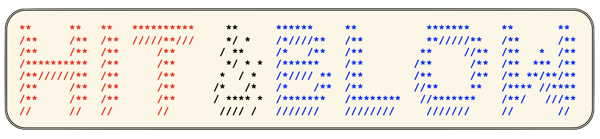
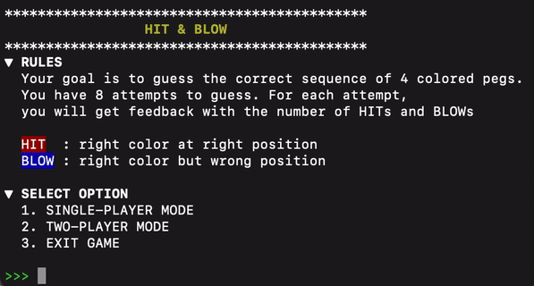
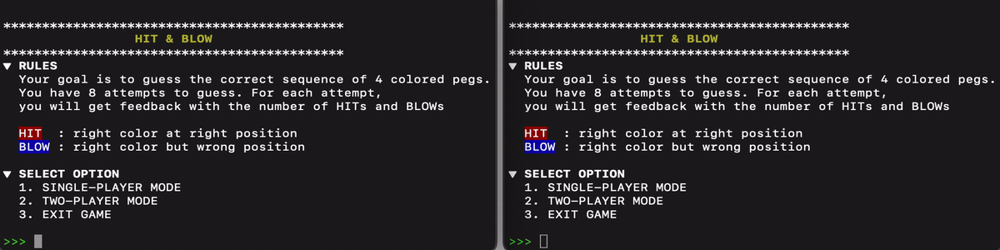
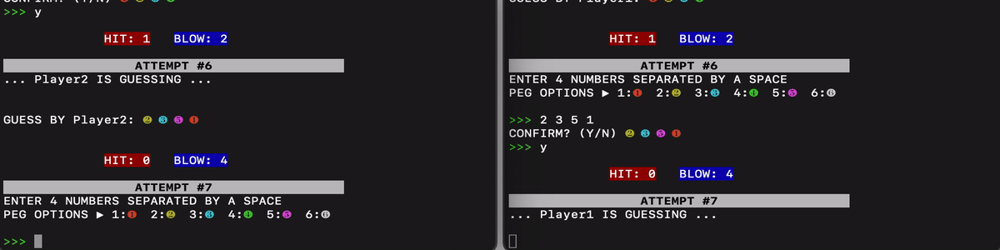

  

<h3 align="center">Hit & Blow</h3>
<h4 align="center">CPSC 5042 Project</h4>

This is a multi-player, client-server implementation of the Hit & Blow game (inspired by the [Clubhouse Games™ on Nintendo Switch](https://www.nintendo.com/sg/switch/as7t/index.html) and the board game [Mastermind](https://en.wikipedia.org/wiki/Mastermind_(board_game))).

## Rules
The player is assigned a random sequence of 4 colored pegs with the goal of guessing the correct position and color of each peg. After each guess, the player is told how many "hits" and "blows" they scored. A "hit" is when a peg has both correct color and correct position, and a "blow" is when the peg has correct color but incorrect position. To win, the player must guess the correct sequence within 8 attempts. The colors of the pegs are chosen from a set of six colors: red, yellow, blue, green, pink and white.

Specific to this implementation, a server program will manage single and multi-player games. If a user (i.e. a client) chooses to play by themselves, the server will generate a random sequence of colored pegs for them to guess. If the user wants to play with someone else, then the server will match them with another user and generate a sequence of colored pegs. The two users take turns to guess the correct sequence within 8 combined attempts.

## Instructions (for macOS)

Compilation:

 
Clone the repository locally. Build the source code in the terminal (opened at the root folder) by running the <code>make</code> command. Alternatively, run the following comands in the terminal
<pre>
<code>
g++ -std=c++11 -pthread -o server src/server/main.cpp src/server/RPCServer.cpp src/utility/HitAndBlow.cpp
g++ -std=c++11 -o client src/client/main.cpp src/client/RPCClient.cpp src/utility/HitAndBlow.cpp
</code>
</pre>

Execution:

 
Execute server and client programs: 
<b>Method 1</b> -- Specify IP address and port number of the server (in the LAN). The server program and the client program can operate on two different computers on the same local area network (LAN). Replace <code>[PORT]</code> and <code>[IP_ADDRESS]</code> with the desired port in the server and its IP address.
<pre>
<code>
./server [PORT]
./client [IP_ADDRESS] [PORT]
</code>
</pre>
<b>Method 2</b> -- Use localhost (127.0.0.1) and port 8080 as default. When both server program and client program are placed on the same computer, simply execute the following commands to start the program.
<pre>
<code>
./server
./client
</code>
</pre>

## Gameplay

### Single-player mode
1. Player selects single-player mode to start the game. (Server set the answer pegs.)
2. Player types in four numbers which represent the colored pegs separated by a space to guess the color and position of four pegs.
3. Server returns the "hits" and "blows" for the player's guess.
4. Player could use this information to improve their guess.
5. Repeat steps 2 - 4 until player guesses the correct answer (i.e. the player has won), or a total of 8 guess are made without getting the correct answer (i.e. the player has lost).
 

  

### Multi-player mode
1. This mode is essentially similar to the single-player mode. The key difference is that the server matches two players who select two-player mode to start the game. 
2. The two players take turns to guess the color and position of four pegs. The guess made by one player is relayed to the other player. 
3. They are allowed 4 guess each to estimate the correct peg sequence.
 

  

 

  

